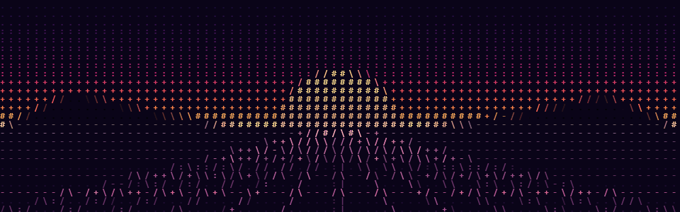

# img2asc

**Turn any image or video into retro, color ASCII art.**

[](https://github.com/anirudhkottayil/ascii/actions/workflows/build-wheels.yml)



`img2asc` samples an image — or every frame of a video — into a grid of cells, picks a character for each one based on brightness and detected edges, and renders the whole thing back out in a classic IBM VGA terminal font, in full color. The output is a real PNG or MP4, for video.

## Installation

Pick the wheel for your platform and install it with [pipx](https://pipx.pypa.io/)

**Linux**
```bash
pipx install https://github.com/anirudhkottayil/ascii/releases/download/v0.1.0/img2asc-0.1.0-py3-none-linux_x86_64.whl
```

**macOS**
```bash
pipx install https://github.com/anirudhkottayil/ascii/releases/download/v0.1.0/img2asc-0.1.0-py3-none-macosx_10_15_universal2.whl
```

**Windows**
```powershell
pipx install https://github.com/anirudhkottayil/ascii/releases/download/v0.1.0/img2asc-0.1.0-py3-none-win_amd64.whl
```

Don't have pipx? `pip install --user pipx && pipx ensurepath`, then reopen your terminal.

## Usage

Convert a single image:

```bash
img2asc photo.jpg
```

That writes `output.png` using the defaults below. Every option can be overridden:

| Flag | Default | Meaning |
|---|---|---|
| `-c`, `--cell` | `8` | Size, in pixels, of the square block sampled for each character |
| `-r`, `--render-size` | `6` | Size, in pixels, each rendered character takes up in the output |
| `-o`, `--output` | `output.png` | Output filename |
| `--video` | off | Treat the input as a video instead of a still image |

Smaller cells mean more, smaller characters — finer detail, and a bigger output image. A larger `--render-size` scales the whole output up without changing how much detail gets sampled.

```bash
img2asc portrait.jpg -c 6 -r 10 -o portrait_ascii.png
```

Convert a video — every frame is converted in parallel across all your CPU cores, then reassembled with the original audio track:

```bash
img2asc clip.mp4 --video -o clip_ascii.mp4
```

## Requirements

- Python 3 — any recent version, the wheels aren't tied to a specific one
- [ffmpeg](https://ffmpeg.org/) on your `PATH` — only needed for `--video`

## How it works

The conversion itself runs in a small, dependency-free C core, not Python. Each sampled cell is checked for a strong edge — horizontal, vertical, or either diagonal — and drawn as a line character if one is found, or shaded using a five-level brightness ramp if not. Every character is then tinted with that cell's own average color and drawn using a bundled Px437 IBM VGA font. Python's job is everything around that: argument parsing, pulling frames out of a video and stitching them back together with `ffmpeg`, and running the whole thing in parallel — the actual pixel-crunching happens in the compiled binary, so it stays fast even on large images and long clips.
